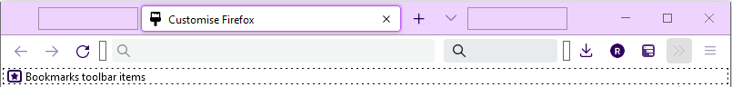

# FirefoxCustomisations
contains all the custom css themes and extensions i use for firefox

**NOTE: The tabs comming back when the tree tabs are hidden is slightly broken, this is due to firefox's implimentation of the has selector being in beta and not quite working correctly, not my code**

## Extensions
**NOTE: This only contains the extensions that change the styling in any way**
- Firefox Colour https://addons.mozilla.org/en-GB/firefox/addon/firefox-color/ (this is not needed as it was only used to generate the theme files)
- Tree Style Tab https://addons.mozilla.org/en-GB/firefox/addon/tree-style-tab/
- Tree Style Tab Extensions
  + TST Indent Line https://addons.mozilla.org/en-GB/firefox/addon/tst-indent-line/ (with Show Always Enabled)
  + TST Tab Search https://addons.mozilla.org/en-GB/firefox/addon/tst-search/

## Custom css
- userChrome.css [./userChrome.css](./userChrome.css) see [./userChrome.md](./userChrome.md)

## Toolbar Customisations
NOTE this will look different without the Custom css above

to get there go to (there are other ways to get there)

`≡` > `More tools` > `Cusomise toolbar...`

Aditionaly I have my bookmark bar set to always show

in the Cusomise toolbar page at the bottom go to

`Toolbars` > `Bookmarks Toolbar` > `Always Show`

another thing that I have changed is the Density again at the bottom of the Cusomise toolbar page.

(Firefox version 89 and up)
> However when aplying this setting a pref needs to be changed 
> go to `about:config` and set the `browser.compactmode.show` to `true`

then go to

`Density` > `Compact`
> this has a `not supported` warning in newer versions from my experience it works fine

## Theme
Generated with Firefox Colour.

To use can be ziped and renamed from `.zip` to `.xpi`. (note there is issues with this method as it has to be privately published)

Should also be available in the releases.

Alternativly if you have the Firefox Colour Extension installed you can find a share link [here](https://color.firefox.com/?theme=XQAAAAKTAQAAAAAAAABBKYhm849SCia9U4KEGccwS-xMDPsqvXkIbAF6EJDWcx9sS_Bi3JZGE6ZZI2STfI2PTljkk0BgVDr_x5nZIXQTNQvpV_y9uYuRVo-3iuAeC3IhKKigWxnnt8IC9aL4MJRjxEDRWMsuraA9rnFyohT3vrE9RZKNjKeaMRfWTVjoxTeTWfQ0CLgoJUAACix4S9wYQm_9woPubekmFhNQRXIkdtn6zaxqBXnfMgcORiLlZjPMmvNprd6EFCk047BSYXWX4NWj0mb8lPJbnxyaOp7tx31AR56SsGDzGsZQ-Bp2RPFvxQMZxL-85iOHOrT-8ulxog)

## Extension Data
**COMMING SOON**

## Broser Pref's
> ### How to acctualy use these options
> 
> go to `about:config` accept the warning
> 
> then in the search bar search for the pref you want to change
> 
> then change the value to the desired value

to start the ones i allready mentioned

`browser.compactmode.show` = `true`

`toolkit.legacyUserProfileCustomizations.stylesheets` = `true`

to change the ctrl+tab menu to do like most other apps (i.e. most recently used first)

`browser.ctrlTab.sortByRecentlyUsed` = `true`

this is because the animation was slow and anoying

(also i couldnt replicate it for the sidebar)

`browser.fullscreen.animate` = `false`

this means that the browser dosent close when the last tab is

`browser.tabs.closeWindowWithLastTab`	= `false`

this is required for the newest version of the userChrome.css to work as it impliments the long awaited has selector.
this is a selector that is usefull in many cirumstances however the pref should eventualy be removed as the pref is
enabaling the beta version of the has selector however it should be switched to enabled by default soon

`layout.css.has-selector.enabled` = `true`
